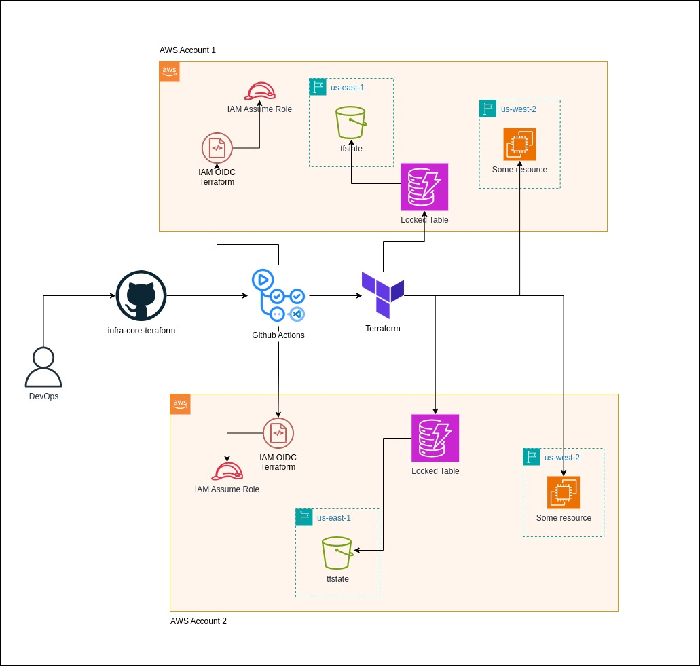

# Infrastructure Core Terraform

This repository contains Terraform configurations for managing core infrastructure resources across multiple environments.

## Overview

This project uses Terraform to manage AWS infrastructure with a workflow automation using GitHub Actions. It supports multiple environments and includes state management using S3 backend with DynamoDB locking.



## Prerequisites

- Terraform v1.8.3
- AWS CLI configured
- GitHub Actions enabled
- Access to AWS with appropriate permissions

## Initial Setup
Maybe you will need replicate this steps at all AWS accounts with you want to use...

1. Create a bucket terraform state (ensure the unique bucket name):

```bash
aws s3api create-bucket --bucket infra-core-terraform-xyz --region us-east-1 --create-bucket-configuration LocationConstraint=us-east-1
```

2. Create a DynamoDB table to lock id, to get more security with parallel executions (don't required):

```bash
aws dynamodb create-table \
    --table-name infra_core_terraform_lock \
    --attribute-definitions \
        AttributeName=lockID,AttributeType=S \
    --key-schema \
        AttributeName=lockID,KeyType=HASH \
    --provisioned-throughput \
        ReadCapacityUnits=5,WriteCapacityUnits=5
```

3. Set the values inside backend.tf:

```hcl
  backend "s3" {
    bucket = "infra-core-terraform-xyz"
    key    = "state/us-west-2/terraform.tfstate"
    region = "us-east-1"
    dynamodb_table = "infra_core_terraform_lock"
  }
```

### Create the first resources roles to OIDC

1. Create a OIDC provider:
```bash
aws iam create-open-id-connect-provider \
  --url "https://token.actions.githubusercontent.com" \
  --client-id-list "sts.amazonaws.com" \
```

2. Create Role to GitHub Actions repository IaC
```bash
aws iam create-role \
  --role-name "github-actions-iac-role" \
  --assume-role-policy-document '{
    "Version": "2012-10-17",
    "Statement": [
      {
        "Effect": "Allow",
        "Principal": {
          "Federated": "arn:aws:iam::<YOUR-AWS-ACCOUNT-ID>:oidc-provider/token.actions.githubusercontent.com"
        },
        "Action": "sts:AssumeRoleWithWebIdentity",
        "Condition": {
          "StringEquals": {
            "token.actions.githubusercontent.com:aud": "sts.amazonaws.com",
            "token.actions.githubusercontent.com:sub": [
              "repo:davidlimacardoso/infra-core-terraform:ref:refs/heads/main",
              "repo:davidlimacardoso/infra-core-terraform:ref:refs/heads/stage",
              "repo:davidlimacardoso/infra-core-terraform:ref:refs/heads/developer",
              "repo:davidlimacardoso/infra-core-terraform:pull_request"
            ]
          }
        }
      }
    ]
  }'
```

3. Create the policy to GitHub Actions role IaC
```bash
aws iam create-policy \
  --policy-name "github-actions-iac-policy" \
  --policy-document '{
    "Version": "2012-10-17",
    "Statement": [
      {
        "Effect": "Allow",
        "Action": "*",
        "Resource": "*"
      }
    ]
  }'
```

4. Attach the policy to the Role
```bash
aws iam attach-role-policy \
  --role-name "github-actions-iac-role" \
  --policy-arn "arn:aws:iam::<YOUR-AWS-ACCOUNT-ID>:policy/github-actions-iac-policy"
```


## Project Structure
```
├── infra
│   └── aws
│       ├── artemis                     -> { account name 1 } 
│       │   ├── account.json            -> { account number id } 
│       │   ├── sa-east-1               -> { region provider } 
│       │   │   ├── backend.tf
│       │   │   ├── destroy_config.json
│       │   │   ├── envs
│       │   │   │   ├── dev.tfvars
│       │   │   │   ├── prod.tfvars
│       │   │   ├── { you tf files }
│       │   └── us-east-1               -> { region provider } 
│       │       ├── backend.tf
│       │       ├── destroy_config.json
│       │       ├── eks.tf
│       │       ├── envs
│       │       │   ├── dev.tfvars
│       │       │   ├── prod.tfvars
│       └── zeus                        -> { account name 2 } 
│           ├── account.json            -> { account number id } 
│           └── us-west-2               -> { region provider } 
│               ├── backend.tf
│               ├── destroy_config.json
│               ├── envs
│               │   ├── dev.tfvars
│               │   ├── prod.tfvars
│               ├── outputs.tf
...
```

## Configuration

### Environment Variables

The following inputs are required for the workflow:

- `environment`: Target environment name
- `aws-assume-role-arn`: AWS IAM role ARN to assume
- `aws-region`: AWS region for deployment
- `aws-statefile-s3-bucket`: S3 bucket for Terraform state storage
- `aws-lock-dynamodb-table`: DynamoDB table for state locking

## Workflow Features

- **State Management**: Remote state storage in S3 with DynamoDB locking
- **Multiple Environments**: Supports different environments using Terraform workspaces
- **Infrastructure Validation**: Includes terraform validate step
- **Conditional Destruction**: Supports infrastructure destruction based on configuration
- **Plan and Apply**: Separated plan and apply steps for better control

## Usage

1. Configure environment-specific variables in `./infra/aws/account_name/region/envs/{environment}/terraform.tfvars`
2. Update destroy configuration in `destroy_config.json` if needed
3. Push changes to trigger the workflow

## Workflow Steps

1. Checkout code
2. Setup Terraform
3. Configure AWS credentials
4. Check destroy configuration
5. Initialize Terraform
6. Validate Terraform configuration
7. Plan or Destroy (based on configuration)
8. Apply changes (if not destroying)

## Security

- Uses OIDC federation for AWS authentication
- Implements workspace isolation for different environments
- Utilizes remote state locking

## Outputs of Terraform Workflow

- Example of plan:


- Example of apply:


- Example of destroy:


## Contributing

1. Create a new branch
2. Make your changes
3. Submit a pull request

## State Management

Terraform state is stored remotely with the following configuration:
- Backend: S3
- State file key: Repository name
- Lock table: DynamoDB


## How to get started?
- Create the GitHub Identity Provider in your AWS account
- Create an IAM Role in your AWS account (Minimum permissions for S3 and DynamoDB)
- Create an S3 Bucket in your AWS account (Enable Bucket Versioning)
- Create a table in DynamoDB in your AWS account (PartitionKey with the name "LockID")
- Clone this repository
- Configure the workflow files
- Done! You are now ready to deploy infrastructure on AWS with Terraform via a pipeline

:mag: Download the project and test it yourself in practice.
